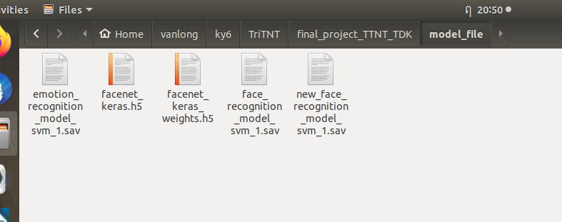
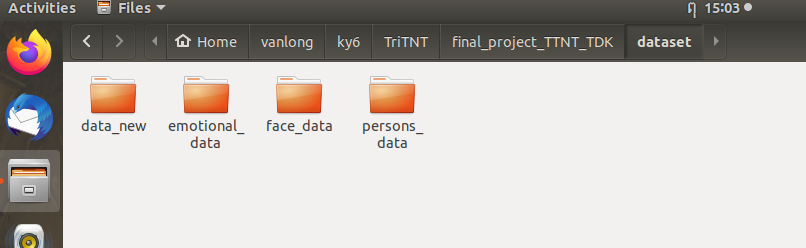

# Trí Tuệ Nhân Tạo Trong Điều Khiển
## Tiểu luận: Emotion and Face Recognition
### Nhóm 2
- Nguyễn Văn Long___________Mssv 1712024
- Huỳnh Mạnh Hưng___________Mssv 1711627 
- Lê Hoàng Hiệp_____________Mssv 1511069
- Hứa Hoàng Thanh Trúc______Mssv 1713729
- Nguyễn Đặng Khôi Nguyên___Mssv 1512207

### Môi trường:
- Ubuntu 18.04
- Python 3.6.9
- Keras 2.3.1
- Tensorflow 2.0.0-alpha0
- Sklearn 0.22.2
- mtcnn 0.1.0

### Chạy chương trình:
- Lưu ý các bạn phải cài **ĐÚNG các PHIÊN BẢN của các thư viện** trên. Có thể chạy file `requirements.txt` hoặc tự cài riêng từng thư viện: `pip3 install -r requirements.txt`. Sau khi cài đặt các thư viên nhớ kiểm tra lại phiên bản của các thư viên có đúng với yêu cầu chưa.
- Clone thư mục này về, `cd` vô forder `final_project_TTNT_TDK` tương tự như sau: `~/vanlong/ky6/TriTNT/final_project_TTNT_TDK$`. Ta thực hiện tất cả các lệnh tại thư mục này và tạo bổ sung 1 số thư mục còn thiếu như hình dưới đây:

- Vì file model nặng nên không thể upload lên github, các bạn tải file mode [tại đây](https://drive.google.com/drive/folders/1sxYaEGKeChUC4NlozsdAQZT09vQYId8f?usp=sharing). Sau khi download các file model về, ta lưu các file model trong thư mục `model_file`. Lưu ý không chỉnh sửa tên các file model, nếu không sẽ bị 1 số lỗi gọi tên file khi chạy chương trình.

- Sau khi cài đặt xong các thư viện và tải file model về, ta chạy lệnh sau để demo kết quả:
`python3 final_source/gui_demo.py`.
- Sau khi chạy file `gui_demo.py` giao diện sẽ trông như sau: 

### Phần giao diện sẽ có 4 chức năng:
#### **Take new face**
- Trong thư mục dataset ta tạo các thư mục như sau để chứa dữ liệu:

- Nếu bạn muốn chương trình có thể nhận diện thêm người mới (chưa có trong dataset). Ghi tên người đó vào ô `Name of new person` và nhấn nút `Take new face`.
#### **Training**
- Sau khi đã thêm người mới vào dataset thì phải train lại model, chỉ cần click vào `Training` và chờ terminal hiện lên dòng `finished` là được.
#### **Testing**
- Phần này để demo nhận diện cảm xúc và khuôn mặt với file pre-train có sẵn gồm 5 cảm xúc và 28 người khác nhau.
#### **New Testing** 
- Sau khi đã thêm người mới và train lại, thì phần này sẽ demo chương trình, và dataset đã thêm vô.
#### 2 phương pháp nhận diện khác:
- Nhận diện bằng CNN không dùng model pre-train
- Nhận diện dùng transfer learning, với pre-train là resnet50, resnet v1.s